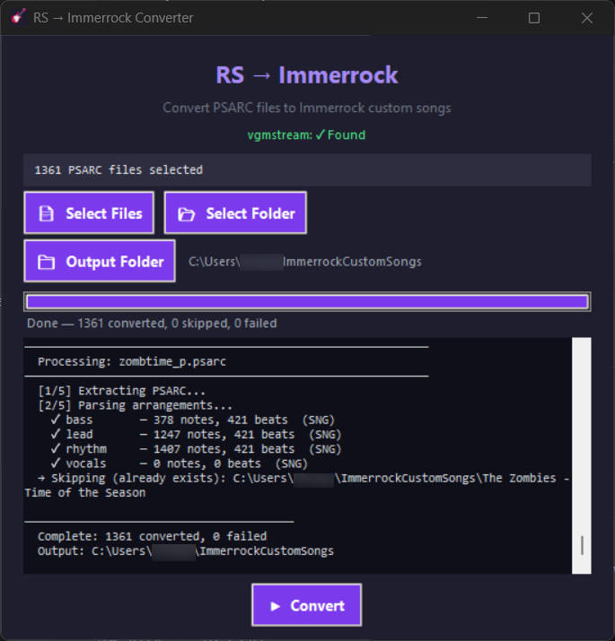
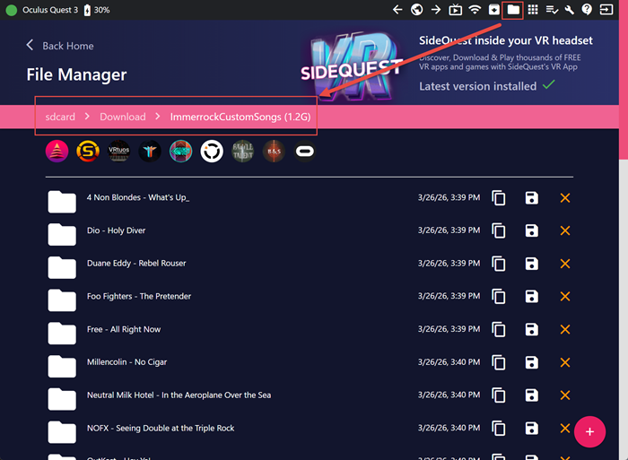

# RS2IR Converter

Convert **Rocksmith 2014 CDLC** (`.psarc`) files into **IMMERROCK** custom song packages for Meta Quest.

Supports Lead, Rhythm, and Bass guitar tracks with full tuning, tempo-map, and section data. Lyrics are exported when present. Album art is converted automatically.

---

## Installation

### Option A: Standalone executable (recommended)

No Python required — download and run.

1. Download the latest release zip from the [Releases page](https://github.com/jermn007/rs2ir-converter/releases)
2. Extract the zip — you'll get an `RS2IR Converter/` folder
3. Double-click `RS2IR Converter.exe`

vgmstream (audio conversion) is bundled inside the executable — no separate download needed.

### Option B: Run from source

Requires Python 3.10+.

```bash
git clone https://github.com/jermn007/rs2ir-converter.git
cd rs2ir-converter
pip install -r requirements.txt
python rs_to_immerrock.py
```

Place `vgmstream-cli.exe` and its DLLs in the same folder as `rs_to_immerrock.py`.

### vgmstream-cli setup (source install only)

vgmstream converts the WEM audio inside PSARCs to OGG. Without it, audio is skipped but everything else still converts.

1. Download the latest release from [github.com/vgmstream/vgmstream/releases](https://github.com/vgmstream/vgmstream/releases)
2. Extract **the entire zip** (not just the `.exe`) into the same folder as `rs_to_immerrock.py`

All `.dll` files must be present alongside `vgmstream-cli.exe`.

### CDLC sources

Custom songs (CDLCs) can be downloaded from [ignition4.customsforge.com](https://ignition4.customsforge.com).

---

## Usage

### GUI (recommended)



- **Select Files** - pick individual `.psarc` files
- **Select Folder** - pick a folder; all `.psarc` files inside are queued
- **Output Folder** - where Immerrock song folders are written (default: `~/ImmerrockCustomSongs`)
- Click **Convert** - progress bar tracks each song; the log shows per-song detail

### Command line (source install only)

```bash
# Single file
python rs_to_immerrock.py song.psarc

# Single file, custom output
python rs_to_immerrock.py song.psarc ./output/

# Entire folder of PSARCs
python rs_to_immerrock.py /path/to/cdlcs/ /path/to/output/
```

Already-converted songs (output folder contains `.mid` files) are skipped automatically, so re-running on a folder only processes new additions.

### Output structure

Each PSARC produces one folder inside the output directory:

```
Artist - Song Title/
    GGLead.mid        ← lead guitar (if present)
    GGRhythm.mid      ← rhythm guitar (if present)
    GGBass.mid        ← bass guitar (if present)
    Song.ogg          ← audio (requires vgmstream)
    Cover.jpg         ← album art
    Info.txt          ← metadata
    Sections.txt      ← section markers for Phrase Refiner
    Lyrics.txt        ← lyrics (empty placeholder if none)
```

Only tracks that exist in the PSARC **and contain at least one note** are generated. Arrangements present in the PSARC with zero notes (e.g. a charter who only mapped bass) are silently skipped and will not appear in Immerrock.

---

## Deploying to Quest

Once conversion is complete, copy each `Artist - Song Title/` folder into the `ImmerrockCustomSongs` folder on your headset. The RS2IR Converter output folder mirrors the Quest folder structure exactly, so you can sync your entire output in one operation.

> Refer to the [Immerrock Custom Song Quick Guide](https://immerrock.com/custom-song-quick-guide) for the exact folder path on the Quest.

### Method 1: ADB (command line)

1. Enable **USB Debugging** on your Quest — Settings → System → Developer → USB Connection Dialog → always allow
2. Connect via USB cable and confirm the prompt in-headset
3. Copy a single song:
   ```bash
   adb push "Artist - Song Title" "/sdcard/Download/ImmerrockCustomSongs/"
   ```
4. Or push your entire output folder at once:
   ```bash
   adb push ImmerrockCustomSongs/. "/sdcard/Download/ImmerrockCustomSongs/"
   ```

### Method 2: SideQuest

1. Install [SideQuest](https://sidequestvr.com/setup-howto) and connect your Quest via USB
2. Click the **Files** icon in the toolbar
3. Navigate to `sdcard/Download/ImmerrockCustomSongs/`
4. Drag and drop song folders from Windows Explorer into the SideQuest file pane



---

## How It Works

### 1. PSARC Extraction

A `.psarc` is a container archive. The table of contents (TOC) is encrypted with **AES-256-CFB** using the publicly-known RS PSARC key. After decryption the TOC lists every internal file; content blocks are zlib-compressed and decompressed on demand. No temporary files are written to disk.

### 2. Arrangement Parsing

Modern CDLCs store note data as binary `.sng` files inside the PSARC (`songs/bin/generic/*.sng`). Older CDLCs fall back to XML arrangement files.

**SNG decryption** uses a separate **AES-256 custom counter mode**: each 16-byte block is XOR'd with `AES_ECB(key, IV+i)` where the IV (embedded at bytes 8–23 of the file) increments by one per block in big-endian carry fashion. After decryption the payload is a 4-byte uncompressed length followed by zlib-compressed binary data.

**SNG binary parsing** reads the decompressed data sequentially through 14 typed sections:

| Section | Used for |
|---|---|
| BPM | Beat/tempo map → MIDI tempo track |
| Chords | Chord template table (fret positions per string) |
| Vocals | Lyrics text and timestamps |
| Sections | Named song sections → `Sections.txt` |
| Arrangements | Per-difficulty note arrays |
| Metadata | Song length, average tempo, tuning offsets |

All difficulty levels in the Arrangements section are **unioned** together (deduplicated by time + string + fret rounded to 5 ms) to produce the densest possible note chart, equivalent to expert difficulty throughout.

**Tuning** is read from the Metadata section as semitone offsets applied to each string's standard open-string MIDI note.

### 3. MIDI Generation

One Type-1 MIDI file is produced per arrangement (Lead, Rhythm, Bass).

**Track 0 - Tempo map**

A `set_tempo` event is written at every beat boundary using the actual inter-beat interval from the SNG beat map. A pre-roll tempo event at tick 0 covers any silence before the first beat, so MIDI tick 0 aligns exactly with OGG position 0.

**Track 1 - Notes**

RS uses one string per channel:

| Channel | String | Standard tuning |
|---|---|---|
| 0 | Low E (string 5) | E2 |
| 1 | A (string 4) | A2 |
| 2 | D (string 3) | D3 |
| 3 | G (string 2) | G3 |
| 4 | B (string 1) | B3 |
| 5 | High e (string 0) | E4 |

Bass uses channels 0–3 only.

MIDI note number = open-string note + fret + tuning offset. Chords are expanded from the chord template table into one note-on per played string, all at the same tick. A 32nd-note gap is enforced between consecutive same-pitch notes to prevent sustain bars from visually merging separate strums.

A **chord mode trigger** (Channel 15, note 30, zero-duration) is emitted at every note-on tick, matching the Immerrock/EoF MIDI spec so that chord diagrams render correctly.

**Channel 15 - Note effects and finger placement**

Additional zero-duration note-on events on Channel 15 carry per-note metadata. Velocity encodes the string: `channel × 5 + 1`.

| Note | Effect |
|---|---|
| 12 | Palm mute |
| 13 | Dead note (fret-hand mute) |
| 14 | Harmonic |
| 15 | Hammer-on / pull-off |
| 17 | Tapping |
| 18 | Stroke down |
| 19 | Stroke up |
| 20 | Slide |
| 30 | Chord mode trigger (every note-on tick) |
| 31–35 | Finger placement: Index, Middle, Ring, Little, Thumb |

Finger signals (31–35) are emitted for chord notes, which carry finger data from the RS chord template. Individual notes rarely have explicit finger assignments in RS CDLC data.

**Pitch bend**

Slides, bends, and vibrato are handled as distinct effect types. Priority order: slide > bend > vibrato.

- **Slides** - a 16-step linear pitch-bend sweep from neutral (0) to the target fret offset over the full sustain. The final event stays at the target pitch (no reset) so Immerrock can draw the slide trail to its endpoint.
- **Bends** - the SNG `BEND_DATA_SECTION` is parsed directly; each timed step emits a pitch bend event at the corresponding semitone value. Pitch bend resets to neutral at note end.
- **Vibrato** - a sinusoidal pitch-bend sweep at 5 Hz / ±384 units (~0.3 semitone peak) for the duration of the note. Pitch bend resets to neutral at note end.

All pitch bend uses a scale of +1280 MIDI units per semitone, matching the Immerrock reference value.

**Timing correction** - RS beat timestamps are absolute seconds from the start of the audio. `_time_to_ticks` interpolates linearly between beat boundaries to place each note at the correct fractional-beat tick position.

### 4. Audio Conversion

The largest WEM file in the PSARC (main audio, not preview) is extracted and piped through `vgmstream-cli` to produce `Song.ogg`.

### 5. Text Files

| File | Contents |
|---|---|
| `Info.txt` | Artist, Title, Album, Year, Genre, BPM, per-track tuning, chart delay |
| `Sections.txt` | Timestamped section names from the SNG, used by Immerrock's Phrase Refiner |
| `Lyrics.txt` | Vocal events grouped into caption phrases in `M:SS.mmm "text"` format; placeholder if none |

### 6. Album Art

The DDS texture from the PSARC is converted to JPEG at up to 512 × 512 using Pillow.

---

## Known Limitations

- **Finger placement on single notes** - RS CDLC charters rarely assign explicit finger data to individual (non-chord) notes, so finger signals are only emitted for chord notes where the data is present
- **Thumb visualization** - note 35 (Thumb) is not yet visualized in Immerrock (per the developer); the signal is emitted but has no in-game effect currently
- **Chord slide pitch bend** - slide pitch bend is only generated for single notes. RS stores per-string slide targets for chords in a separate ChordNotes section; that data is not yet parsed, so chord slides emit the ch15 Slide marker (note 20) only
- **Vocals** in RS CDLCs rarely include beat timing; `Lyrics.txt` is generated but may be empty
- **Drop / open tunings** that go below MIDI note 0 or above 127 are clamped

---

## Attribution

This tool was built by reverse-engineering publicly documented formats. Key references:

- **[Editor on Fire (EoF)](https://github.com/raynebc/editor-on-fire)** by Raymond Cooke - source of the Immerrock MIDI format specification (`src/ir.c`, `src/ir.h`), including channel assignments, velocity conventions, and Channel 15 hand-mode events
- **[vgmstream](https://github.com/vgmstream/vgmstream)** - WEM → OGG audio conversion
- **[RocksmithToolkit](https://github.com/rscustom/rocksmith-custom-song-toolkit)** - reference for SNG binary layout (`Sng2014File.cs`) and SNG/PSARC decryption keys
- **[Immerrock](https://immerrock.com)** - the VR guitar game this targets; custom song format documented at immerrock.com/custom-song-quick-guide
- **[pycryptodome](https://pycryptodome.readthedocs.io)**, **[mido](https://mido.readthedocs.io)**, **[Pillow](https://python-pillow.org)** - Python libraries

---

## License

MIT - see [LICENSE](LICENSE)
